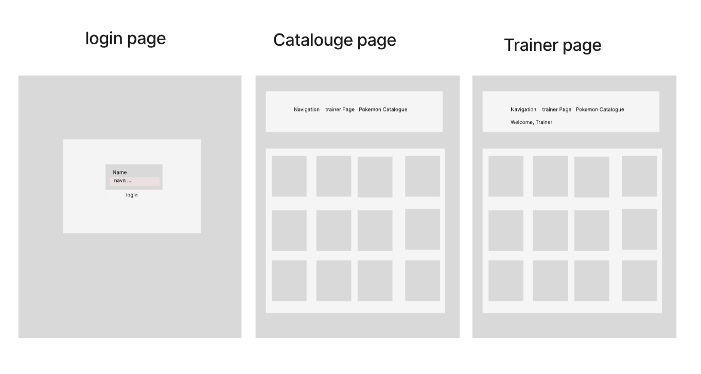

# PokemonFrontendAngular

## Description
This is a Pokemon Trainer web application built in the [Angular framework](https://angular.io/).

## Installation
Clone the repository to run it locally on your machine. To get started, run `npm install` to install the necessary dependencies, and then `npm start` to run the application on your localhost.

If you want to use our [Pokémon Trainer API](https://github.com/dewald-els/noroff-assignment-api), which is hosted on [glitch.com](glitch.com), you can follow the instructions provided in the API repository to set it up. In order to use the API with our application, you will need to add your own API key to `environment.ts` and `environment.development.ts`.

## Usage
You can try the application out live [here](https://pokemon-trainer-rho.vercel.app/).

### Landing Page
To log in, enter a username of your choice. If a user with that username already exists, you will be logged in automatically. However, if no user is found with the entered username, a new user account will be created for you. The username can contain any characters you like, so feel free to choose one that's easy for you to remember.

### Trainer Page
This section displays the Pokémons that you have caught. You can release a Pokémon and remove it from your collection by pressing the **Release pokemon** button.

### Pokémon Catalogue Page
This section displays 1000 Pokémons from the Pokémon Trainer API. You can catch them by pressing the **Catch pokemon** button, and release them by pressing the **Release pokemon** button.

## Components

## Contributors
* Mostafa Mohammedi [@Mostafa-Mohammedi](https://github.com/Mostafa-Mohammedi)
* Marie Havre [@mariehavre](https://github.com/mariehavre)

